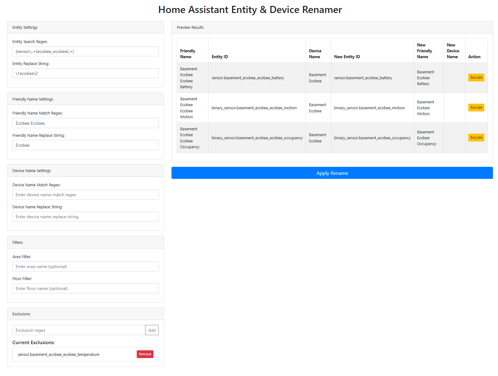

# Home Assistant Entity & Device Renamer


Forked from <https://github.com/saladpanda/homeassistant-entity-renamer>

This project is a web-based tool to rename Home Assistant entities and devices. It allows you to update entity IDs, friendly names, and device names using regex-based search and replace operations. The tool also supports filtering by area and floor, and includes a dry-run mode for confirmation before applying changes.

## Features

- **Entity Renaming:** Search and update entity IDs using regex.
- **Friendly Name Renaming:** Modify the friendly names of entities.
- **Device Renaming:** Update device names (deduplicated by device ID).
- **Filtering:** Filter entities based on area and floor associations.
- **Exclusions:** Exclude specific entities using custom regex patterns.
- **Dry Run Mode:** Preview a summary of changes before confirmation.
- **WebSocket Integration:** Uses Home Assistant's WebSocket API for real-time updates.



## Requirements

- Python 3.12

## Installation

1. **Clone the repository:**
   ```
   git clone https://github.com/rajiteh/homeassistant-entity-renamer.git
   cd homeassistant-entity-renamer
   ```

2. **Create a virtual environment:**
   ```
   python -m venv venv
   ```

3. **Activate the virtual environment:**
   ```
   source ./venv/bin/activate
   ```

4. **Install the required packages:**
   ```
   pip install -r requirements.txt
   ```

## Configuration

Create a `config.py` file in the repository root with the following variables configured:

```python
HOST = "homeassistant.local:8123"  # Replace with your Home Assistant host
ACCESS_TOKEN = "YOUR_LONG_LIVED_ACCESS_TOKEN"  # Replace with your access token
TLS = True  # Set to True if using HTTPS/TLS, otherwise False
SSL_VERIFY = True  # Set to False if you want to disable SSL verification
```

## Running the Application

1. **Activate your virtual environment (if not already active):**
   ```
   source ./venv/bin/activate
   ```

2. **Run the Flask application:**
   ```
   python app.py
   ```

3. **Open your browser:**  
   Navigate to `http://localhost:5000` to access the renamer interface.

## Usage

- **Input Forms:**  
  Use the left column to enter your regex patterns for entity, friendly name, and device name renaming. Set area and floor filters as needed, and exclude entities using the provided exclusion options.

- **Preview:**  
  The right column displays a live preview of changes based on your input.

- **Apply Changes:**  
  Click the "Apply Rename" button to perform a dry run. You will be prompted with a summary of changes (e.g., "Dry run: Updating X devices, Y entity IDs and Z friendly names."). Confirm the prompt to apply the updates.

## License

Licensed under GPLv3

## Contributing

Contributions are welcome! Please open issues or submit pull requests for improvements or bug fixes.
